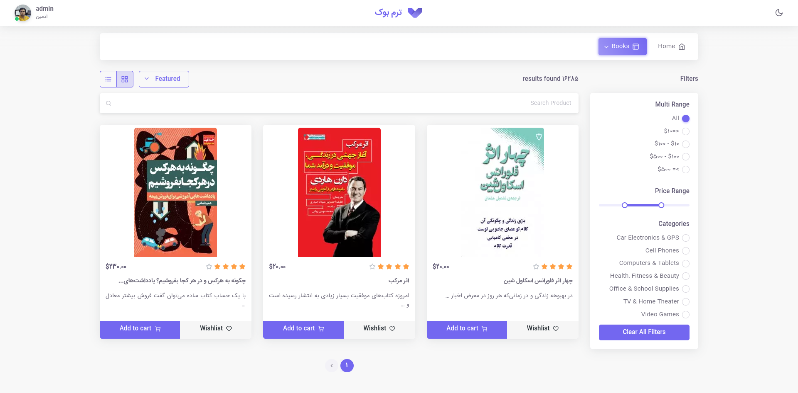

# GoCardless sample application

Book List Page



## Setup

The first thing to do is to clone the repository:

```sh
$ git clone https://github.com/gocardless/sample-django-app.git
$ cd sample-django-app
```

Create a virtual environment to install dependencies in and activate it:

```sh
$ virtualenv2 --no-site-packages env
$ source env/bin/activate
```

Then install the dependencies:

```sh
(env)$ pip install -r requirements.txt
```

Note the `(env)` in front of the prompt. This indicates that this terminal
session operates in a virtual environment set up by `virtualenv2`.
Once `pip` has finished downloading the dependencies:

- Makemigrations and migrate are used to create and migrate the database.

    ```sh
    (env)$ cd project
    (env)$ python manage.py makemigrations
    (env)$ python manage.py migrate
    ```
- And run the server:

  ```sh
  (env)$ python manage.py runserver
  ```

  And navigate to `http://127.0.0.1:8000/gocardless/`.

In order to test the purchase flows, fill in the account details in
`project/gc_app/views.py` to match your **SANDBOX** developer credentials.

## Tests

To run the tests, `cd` into the directory where `manage.py` is:

```sh
(env)$ python manage.py test 
```
